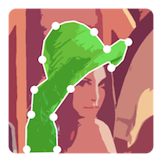

<h1 align="center">
  <br/>labelme
</h1>

<h4 align="center">
  Custom Version of Image Polygonal Annotation 5.8.3 with Python 
</h4>

# Custom LabelMe

This repository contains a modified version of **LabelMe** customized for faster and easier data annotation.

The purpose of these modifications is to reduce annotation time and improve usability for annotation tasks that are difficult to handle in the base version of LabelMe.

---

## Overview

The following custom features and fixes have been added:

1. Pen / Lasso Tool
2. Ghost Flip
3. Redo Functionality
4. Annotation Flipping
5. Show Original Image
6. Previous Zoom Fix
7. Brightness Toggle Fix

---

## Basic Requirements

Make sure you have one of the following installed:

- Python 3.10
- Anaconda latest version

---

## Installation

### 1. Create a Virtual Environment

Creating a virtual environment is optional but recommended.

#### Using Python

```bash
python -m venv labelme_env
labelme_env\Scripts\activate
```

#### Using Anaconda

```bash
conda create -n labelme_env python=3.10 -y
conda activate labelme_env
```

---

### 2. Download the Repository

```bash
git clone https://github.com/MehakKanwal30/custom_labelme.git
cd custom_labelme
```

---

### 3. Install Modified LabelMe

```bash
pip install -e .
```

---

## Running Modified LabelMe

After installation, run:

```bash
labelme
```

---

## Updating on Another PC

Whenever changes are made to the repository, update your local copy using:

```bash
git pull
```

If needed, reinstall using:

```bash
pip install -e .
```

---
# Feature Explanation

---

## 1. Pen / Lasso Tool
### Old Behavior

There was no method to create continuous points using mouse click.

### New Behavior

When the left mouse button is held down and dragged, points are continuously created under the mouse pointer.

### Usage

- Press **Left Shift**, hold the **left mouse button**, and start dragging.
- If drawing is interrupted, it can be continued by pressing **Left Shift** and holding the **left mouse button** again.
- When finished, hold **Left Ctrl** and press the **left mouse button** to end drawing.
- To change the distance between points, adjust the **Lasso Step** value in the toolbar.

---

## 2. Ghost Flip
### Old Behavior

There was no method to flip the canvas and place points on the flipped view.

### New Behavior

Ghost Flip flips the canvas and mouse input for easier point placement.

The final points are still saved according to the original image coordinates, regardless of the flipped view.

### Usage

- Use the respective buttons provided in the toolbar.
- Press **H** to flip the canvas horizontally.
- Press **V** to flip the canvas vertically.

---

## 3. Redo Functionality
### Old Behavior

If a shape was accidentally deleted or removed, there was no backup to restore it.

### New Behavior

A backup is kept so deleted shapes can be restored easily.

### Usage

```text
Ctrl + Y
```

Pressing **Ctrl + Y** after deleting a shape will bring it back.

---

## 4. Annotation Flipping

### Files Modified
### Old Behavior

There was no method to flip a created polygon or shape.

### New Behavior

Any selected shape or line can be flipped vertically or horizontally.

### Usage

- Use the respective buttons provided in the toolbar.
- Press **Ctrl + Shift + H** to flip the selected shape horizontally.
- Press **Ctrl + Shift + V** to flip the selected shape vertically.

---

## 5. Show Original Image

### Files Modified
### Old Behavior

There was no method to temporarily show the original image.

### New Behavior

Because multiple views were added, such as flipped or color-adjusted views, this feature allows the user to temporarily view the original image by removing all effects.

### Usage

```text
B
```

- Press **B** to show the original image.
- Press **B** again to return to the previous view.

---

## 6. Previous Zoom Fix
### Old Behavior

When toggling the keep scale mode, it would not apply to previously loaded images. It only worked on newly loaded images.

### New Behavior

The zoom is applied to any image that is loaded while keep scale mode is toggled.

### Usage

Use the respective buttons provided in the toolbar.

---

## 7. Brightness Toggle Fix
### Old Behavior

When changing the brightness or contrast slider, LabelMe could crash because it tried to update the image for every value change on the slider.

### New Behavior

The image is updated only when the slider is released.

This prevents LabelMe from updating the image for every slider movement and improves stability.

### Usage

Use the respective buttons provided in the toolbar.

---

## Known Issues

- If you encounter a `qtpy` installation issue, run:

```bash
pip install qtpy
```
---

## Notes

This modified version of LabelMe is designed specifically to improve annotation workflow efficiency and provide additional tools that are not available in the base LabelMe version.
